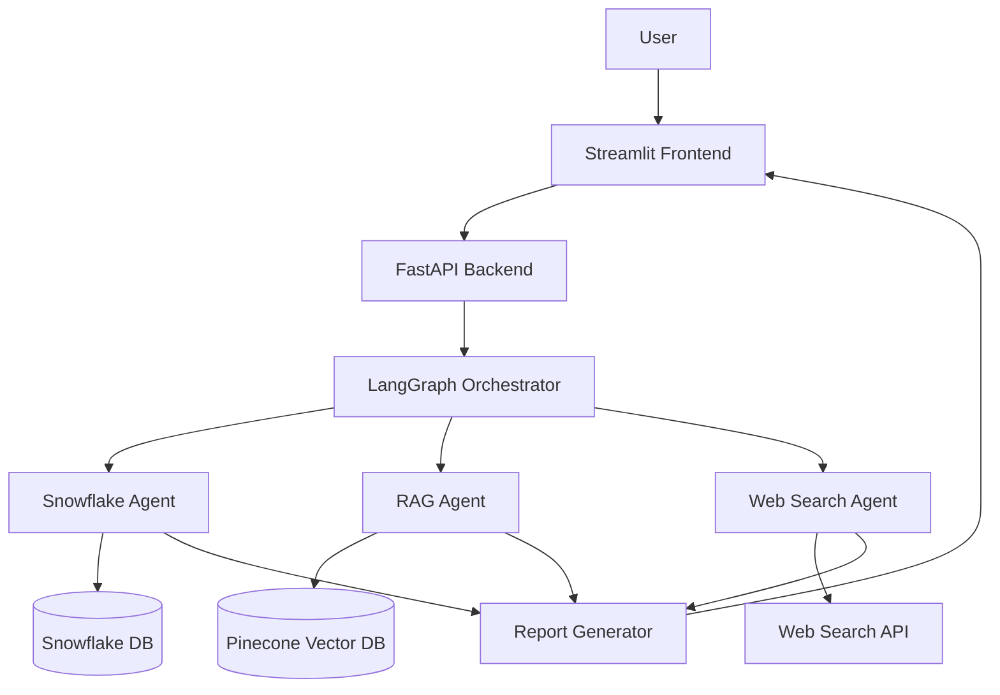

# RAG Pipeline with Multi-Agent System

An integrated research assistant leveraging three specialized agents to produce comprehensive research reports on NVIDIA.

[](https://www.python.org/downloads/)
[](https://openai.com/)
[](LICENSE)
[](https://github.com/psf/black)
[](https://codelabs-preview.appspot.com/?file_id=106NR1vweMmpH44DEJ9zfDCbrTYbA1g37dQby_a1-Vvs/edit?tab=t.5cpih9qtxm58#3)


## Project URLs
- Code Labs: [Codelabs Documentation](https://codelabs-preview.appspot.com/?file_id=106NR1vweMmpH44DEJ9zfDCbrTYbA1g37dQby_a1-Vvs/edit?tab=t.5cpih9qtxm58#3)


## Project Overview

The **NVIDIA Research Assistant** is a generative AI system designed to assist financial analysts and investors by generating detailed research reports on NVIDIA’s financial performance. The system combines three specialized agents to provide a holistic view of NVIDIA’s historical performance, financial metrics, and real-time industry insights:

1. **Snowflake Agent**: Queries structured financial data (e.g., revenue, EPS) from a Snowflake database and generates visualizations.
2. **RAG Agent**: Uses Pinecone for metadata-filtered retrieval from NVIDIA quarterly reports, leveraging Retrieval-Augmented Generation (RAG) to provide historical context.
3. **Web Search Agent**: Fetches real-time data from the web using search APIs (e.g., Tavily) to provide the latest market insights.

The system is built with a multi-agent architecture orchestrated by LangGraph, featuring a FastAPI backend for API services and a Streamlit frontend for user interaction. It supports natural language queries, metadata filtering by year and quarter, and multimodal output (text reports with visualizations). The project is deployed using Docker for scalability and ease of setup.

This project was developed as part of Assignment 5A for the MSAI program, demonstrating proficiency in RAG and multimodal integration as core generative AI techniques.

## System Architecture

The system consists of the following components:

- **Frontend**: Streamlit application for user interaction, allowing users to input queries and view reports.
- **Backend**: FastAPI service that handles API requests and orchestrates the multi-agent system.
- **Orchestrator**: LangGraph-based workflow manager that coordinates agent interactions and synthesizes outputs.
- **Agents**:
  - **Snowflake Agent**: Queries structured data from Snowflake.
  - **RAG Agent**: Retrieves historical data from Pinecone vector database.
  - **Web Search Agent**: Fetches real-time data via web search APIs.
- **Databases**:
  - **Snowflake**: Stores structured financial data.
  - **Pinecone**: Vector database for storing NVIDIA quarterly reports.
- **Deployment**: Docker containers for seamless deployment.

### Architecture Diagram



## Features

- **Research Question Interface**: Supports natural language queries about NVIDIA (e.g., "What was NVIDIA's revenue growth in the past year?").
- **Metadata Filtering**: Allows filtering by year and quarter using Pinecone metadata (e.g., Year: 2023, Quarter: Q2).
- **Agent Selection**: Users can trigger individual agents or combine all agents for a comprehensive report.
- **Structured Reports**: Presents summaries, financial metrics, and insights in a clear Markdown format.
- **Real-time Data**: Incorporates the latest information from web searches.
- **Financial Visualization**: Generates charts and graphics from structured data (e.g., revenue trends over quarters).

## Setup and Installation

### Prerequisites

- **Docker and Docker Compose**: Required for containerized deployment.
- **API Keys**:
  - OpenAI (or alternative LLM provider) for embeddings and text generation.
  - Snowflake for database access.
  - Pinecone for vector storage.
  - Web Search API (e.g., SerpAPI, Tavily, or Bing) for real-time data.
- **Python 3.10+**: If running without Docker, ensure Python is installed with the required dependencies.

### Environment Setup

1. **Clone the Repository**:
   ```bash
   git clone https://github.com/DAMG7245/Assigmnent5A.git
   cd rag-multi-agent
   ```

2. **Create a `.env` File**:
   Create a `.env` file in the project root directory with the following configuration:
   ```
   # LLM Provider
   OPENAI_API_KEY=your_openai_api_key
   
   # Snowflake
   SNOWFLAKE_ACCOUNT=your_snowflake_account
   SNOWFLAKE_USER=your_snowflake_user
   SNOWFLAKE_PASSWORD=your_snowflake_password
   SNOWFLAKE_DATABASE=your_snowflake_database
   SNOWFLAKE_SCHEMA=your_snowflake_schema
   SNOWFLAKE_WAREHOUSE=your_snowflake_warehouse
   SNOWFLAKE_ROLE=your_snowflake_role
   SNOWFLAKE_STAGE=your_snowflake_stage
   
   # Pinecone
   PINECONE_API_KEY=your_pinecone_api_key
   PINECONE_ENVIRONMENT=your_pinecone_environment
   PINECONE_INDEX=nvidia-reports
   
   # Web Search API
   SEARCH_API_KEY=your_search_api_key
   SEARCH_API_PROVIDER=tavily  # Options: serpapi, tavily, bing
   ```

3. **Install Dependencies (Optional, if not using Docker)**:
   If you prefer to run the application without Docker, install the dependencies:
   ```bash
   pip install -r requirements.txt
   ```

### Running with Docker

1. **Build and Start Containers**:
   ```bash
   docker-compose up -d
   ```

2. **Access the Application**:
   - **Frontend**: Open [http://localhost:8501](http://localhost:8501) in your browser.
   - **Backend API**: Access the API at [http://localhost:8000](http://localhost:8000).

### Running Without Docker (Alternative)

1. **Start the Backend**:
   ```bash
   cd backend
   uvicorn main:app --host 0.0.0.0 --port 8000
   ```

2. **Start the Frontend**:
   ```bash
   cd frontend
   streamlit run app.py
   ```

## Usage

1. **Open the Streamlit Application**:
   Navigate to [http://localhost:8501](http://localhost:8501) in your browser.

2. **Enter a Research Question**:
   Input a natural language query about NVIDIA in the text field (e.g., "What was NVIDIA's revenue growth in the past year?").

3. **Select Filters (Optional)**:
   - Choose specific years and quarters to filter the results (e.g., Year: 2023, Quarter: Q2).
   - Select which agents to activate (e.g., RAG Agent, Snowflake Agent, Web Search Agent).

4. **Submit and Review**:
   Submit the query and review the generated research report, which includes text, financial metrics, and visualizations.

### Example Queries and Screenshots

Below are example queries with placeholders for screenshots demonstrating the system in action. (Note: Screenshots should be added to the `docs/screenshots/` directory and linked here.)

#### Example 1: Revenue Growth Query
- **Query**: "What was NVIDIA's revenue growth in the past year?"
- **Output**:
  ```
  ## NVIDIA Financial Analysis

  ### Historical Performance
  NVIDIA's total revenue for Q2 FY23 was **$6.704 billion**, representing a **3% YoY growth** from **$6.518 billion** in Q2 FY22 [Source: NVIDIA_2023_Q2_CFO_Commentary.pdf, Year: 2023, Quarter: q2].

  ### Sources and References
  - NVIDIA_2023_Q2_CFO_Commentary.pdf (2023, q2)
  ```
- **Screenshot**:
  

#### Example 2: Market Trends Query
- **Query**: "What are the current market trends affecting NVIDIA's stock price?"
- **Output**:
  ```
  ## NVIDIA Financial Analysis

  ### Latest Insights
  Recent market trends indicate a growing demand for AI chips, positively impacting NVIDIA's stock price due to its leadership in GPU technology [Source: Tavily Web Search, April 2025].

  ### Sources and References
  - Tavily Web Search (April 2025)
  ```
- **Screenshot**:
  

#### Example 3: Financial Metrics Query
- **Query**: "Compare NVIDIA's P/E ratio to industry standards in 2023"
- **Output**:
  ```
  ## NVIDIA Financial Analysis

  ### Financial Metrics
  NVIDIA's P/E ratio in Q2 2023 was **45.2**, compared to an industry average of **30.5** for semiconductor companies [Source: Snowflake DB].

  ### Sources and References
  - Snowflake DB
  ```
- **Screenshot**:
  

## API Documentation

The FastAPI backend provides endpoints for interacting with the research assistant programmatically. The API is accessible at [http://localhost:8000](http://localhost:8000) when the backend is running.

### Endpoints

#### 1. Generate Research Report
- **Endpoint**: `/research`
- **Method**: `POST`
- **Description**: Generates a research report based on the provided query and filters.
- **Request Body**:
  ```json
  {
    "query": "What was NVIDIA's revenue growth in the past year?",
    "years": [2023],
    "quarters": [2],
    "agents": ["rag", "snowflake", "websearch"]
  }
  ```
  - `query` (string): The research question.
  - `years` (array of integers, optional): Years to filter by.
  - `quarters` (array of integers, optional): Quarters to filter by (1-4).
  - `agents` (array of strings, optional): Agents to activate (`rag`, `snowflake`, `websearch`).
- **Response**:
  ```json
  {
    "content": "## NVIDIA Financial Analysis\n\n### Historical Performance\n...",
    "historical_data": {
      "content": "NVIDIA's total revenue for Q2 FY23 was $6.704 billion...",
      "sources": ["NVIDIA_2023_Q2_CFO_Commentary.pdf"],
      "confidence_score": 85
    },
    "financial_metrics": {
      "content": "NVIDIA's P/E ratio in Q2 2023 was 45.2...",
      "chart": null,
      "sources": ["Snowflake DB"]
    },
    "latest_insights": {
      "content": "Recent market trends indicate a growing demand for AI chips...",
      "sources": ["Tavily Web Search"]
    },
    "processing_time": "3.5s"
  }
  ```
- **Error Response**:
  ```json
  {
    "error": "Invalid query parameters"
  }
  ```

#### 2. Health Check
- **Endpoint**: `/health`
- **Method**: `GET`
- **Description**: Checks the health of the backend service.
- **Response**:
  ```json
  {
    "status": "healthy",
    "agents": {
      "rag": true,
      "snowflake": true,
      "websearch": true
    }
  }
  ```

### API Usage Example
Using `curl` to generate a research report:
```bash
curl -X POST http://localhost:8000/research \
  -H "Content-Type: application/json" \
  -d '{"query": "What was NVIDIA'\''s revenue growth in the past year?", "years": [2023], "quarters": [2], "agents": ["rag", "snowflake", "websearch"]}'
```

## Project Structure

```
rag-multi-agent/
├── backend/
│   ├── agents/
│   │   ├── rag_agent.py           # RAG agent for Pinecone retrieval
│   │   ├── snowflake_agent.py     # Snowflake agent for structured data
│   │   └── websearch_agent.py     # Web search agent for real-time data
│   ├── langraph/
│   │   └── orchestrator.py        # LangGraph orchestrator for agent coordination
│   └── utils/
│       ├── chunking.py            # Document chunking for RAG
│       ├── conn_snowflake.py      # Snowflake connection utility
│       └── data_fetch.py          # Data fetching utilities
├── frontend/
│   └── app.py                     # Streamlit frontend application
├── docker/
│   ├── Dockerfile.backend         # Dockerfile for backend
│   └── Dockerfile.frontend        # Dockerfile for frontend
├── docs/
│   ├── screenshots/               # Screenshots for usage examples
│   └── contributing.md            # Contribution guidelines
├── tests/
│   ├── test_rag_agent.py          # Unit tests for RAG agent
│   ├── test_snowflake_agent.py    # Unit tests for Snowflake agent
│   └── test_websearch_agent.py    # Unit tests for Web Search agent
├── requirements.txt               # Python dependencies
├── docker-compose.yml             # Docker Compose configuration
├── LICENSE                        # MIT License file
└── README.md                      # Project documentation
```

## Code Documentation

All source code is thoroughly documented with comments to ensure clarity and maintainability. Below is an overview of the documentation approach:

- **Inline Comments**: Each function and class includes inline comments explaining its purpose, parameters, and return values.
  - Example from `rag_agent.py`:
    ```python
    def query(self, query_text: str, years: Optional[List[int]] = None, quarters: Optional[List[int]] = None) -> Dict[str, Any]:
        """
        Query the RAG system with optional metadata filtering by multiple years and quarters.
        
        Args:
            query_text: The query text
            years: Optional list of years to filter by
            quarters: Optional list of quarters to filter by
            
        Returns:
            Dictionary with retrieved context and generated response
        """
    ```
- **Module-Level Comments**: Each file includes a header comment describing its role in the system.
  - Example from `snowflake_agent.py`:
    ```python
    # backend/agents/snowflake_agent.py
    """
    Snowflake Agent for querying structured financial data from Snowflake database.
    Provides functionality to fetch financial metrics and generate visualizations.
    """
    ```
- **Error Handling**: Code includes detailed logging for debugging and error handling.
- **Testing Scripts**: The `tests/` directory contains unit tests for each agent, with comments explaining test cases.

## Development

### Adding New Data Sources

To extend the Snowflake Agent with additional data:
1. Update the Snowflake database schema with new tables or columns.
2. Modify `snowflake_agent.py` to include queries for the new data.
3. Update the report generation logic in `orchestrator.py` to incorporate the new data.

### Modifying the RAG System

To update the RAG system:
1. Adjust the chunking strategy in `chunking.py` (e.g., change chunk size or overlap).
2. Update metadata extraction in the RAG pipeline to include additional fields.
3. Modify the Pinecone index schema if new metadata fields are added.

### Adding New Agent Types

To add a new agent:
1. Create a new agent module in the `agents/` directory (e.g., `new_agent.py`).
2. Update the `orchestrator.py` to integrate the new agent into the workflow.
3. Modify the Streamlit frontend (`app.py`) to allow users to interact with the new agent.

## Testing

The project includes unit tests for each agent, located in the `tests/` directory. To run the tests:
```bash
cd tests
python -m unittest discover
```

Example test case from `test_rag_agent.py`:
```python
# tests/test_rag_agent.py
import unittest
from agents.rag_agent import RagAgent

class TestRagAgent(unittest.TestCase):
    def setUp(self):
        self.agent = RagAgent()

    def test_query(self):
        result = self.agent.query("Test query", years=[2023], quarters=[2])
        self.assertIn("response", result)
        self.assertTrue(len(result["sources"]) > 0)

if __name__ == "__main__":
    unittest.main()
```

## Troubleshooting

### Common Issues

- **Connection to Snowflake Fails**:
  - **Cause**: Incorrect credentials or network issues.
  - **Solution**: Verify your Snowflake credentials in the `.env` file and ensure network access to the Snowflake account.
- **Pinecone Queries Return Empty Results**:
  - **Cause**: Index not populated or incorrect metadata filters.
  - **Solution**: Check that the `nvidia-reports` index in Pinecone is populated and that metadata filters (e.g., `year`, `quarter`) match the stored data.
- **Web Search API Rate Limiting**:
  - **Cause**: Exceeding API request limits.
  - **Solution**: Implement retry logic in `websearch_agent.py` or switch to an alternative provider (e.g., from SerpAPI to Tavily).

## Contributing

Contributions are welcome! Please refer to the [CONTRIBUTING.md](docs/contributing.md) file for guidelines on how to contribute to this project, including coding standards, pull request processes, and issue reporting.

### Contributing Guidelines (Summary)
- Fork the repository and create a feature branch.
- Follow the project’s coding style (PEP 8 for Python).
- Add unit tests for new features.
- Submit a pull request with a detailed description of changes.

## Resources

- [Pinecone Hybrid Search with Metadata](https://docs.pinecone.io/docs/hybrid-search)
- [LangGraph Multi-Agent Example](https://langchain-ai.github.io/langgraph/getting-started/multi-agent/)
- [FastAPI Documentation](https://fastapi.tiangolo.com/)
- [Streamlit Documentation](https://docs.streamlit.io/)
- [Snowflake Documentation](https://docs.snowflake.com/)
- [SerpAPI Documentation](https://serpapi.com/docs)
- [Tavily Documentation](https://docs.tavily.com/)

## License

This project is licensed under the MIT License. See the [LICENSE](LICENSE) file for details.

## Acknowledgments

- Special thanks to the teaching staff for their guidance and support.
- Gratitude to the open-source community for providing tools like LangChain, Pinecone, and Streamlit.

---

